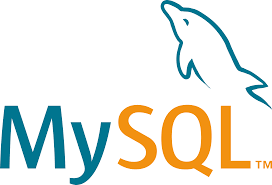

# Hello!

My name is Frederico Santos Carvalho, I am 30 years old.  
I have a degree in mathematics from IFRJ in 2019, I am currently studying to become a Data Scientist, I have a background in Business Intelligence, Power BI, Qlik Sense, My SQL and Python. Now I'm focused on learning Data Science and Machine Learn  
I've been using GitHub as a portfolio of my projects

   

## Framework | IDE | Tools

    
   
   
   
  

## Data Science | Business Intelligence

  
  

## Contatos

